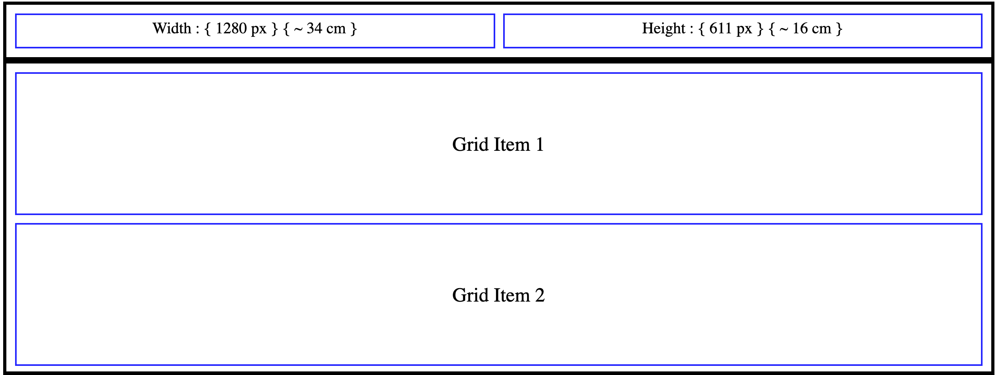
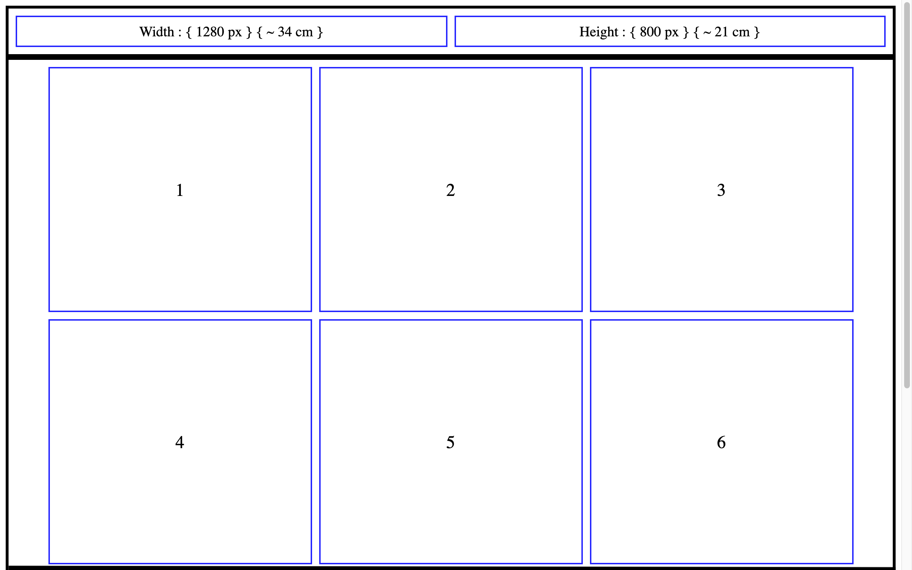
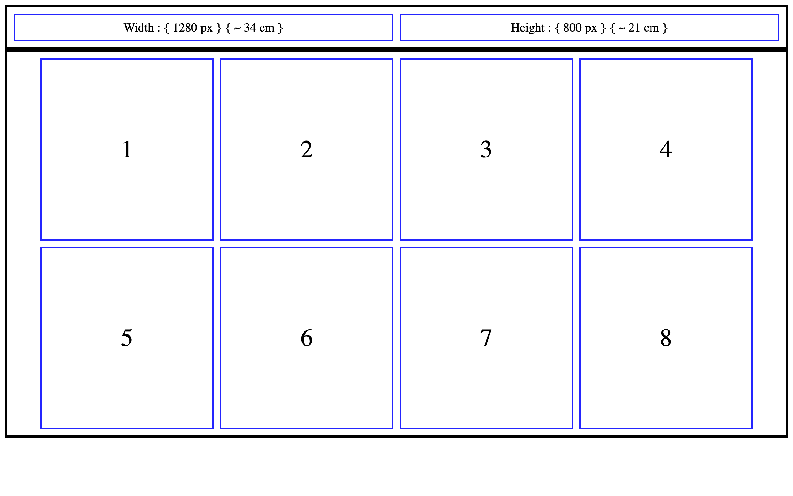
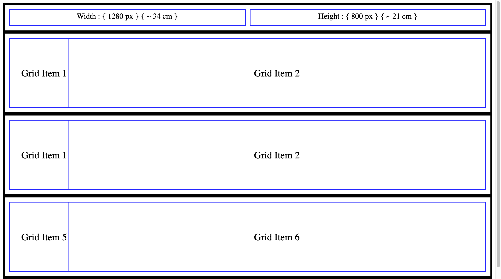
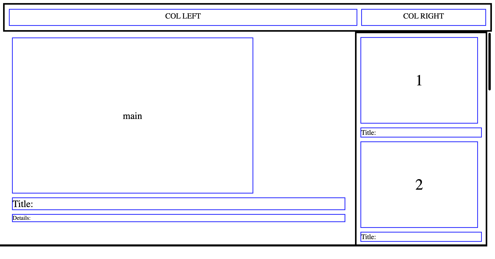
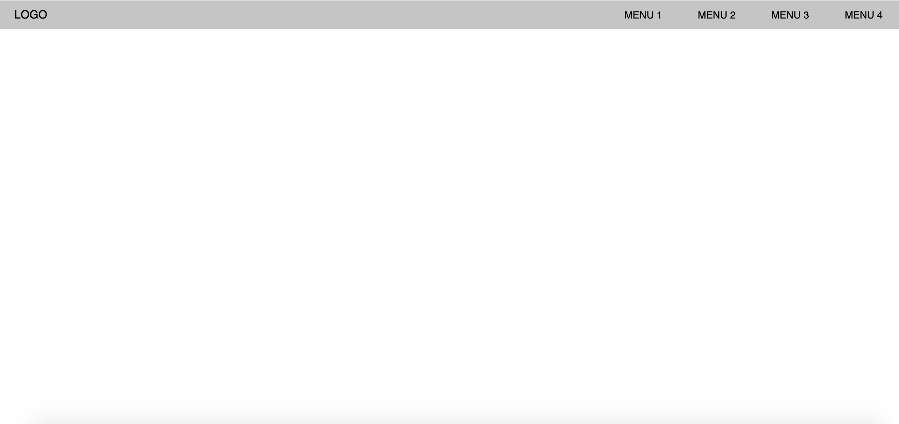
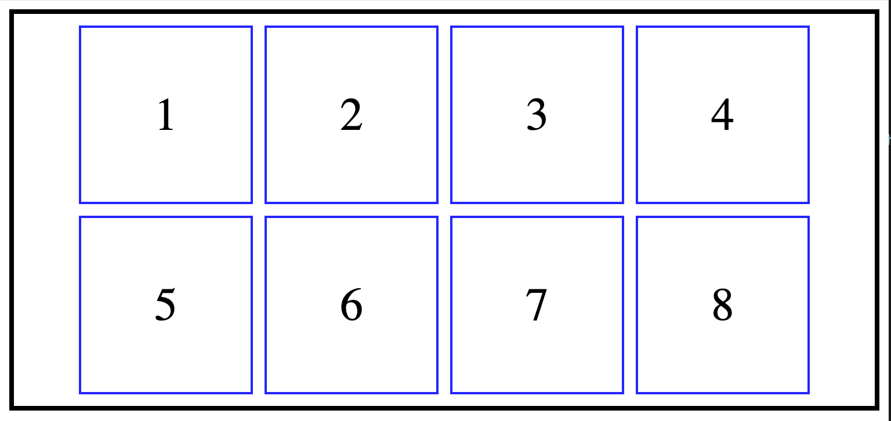
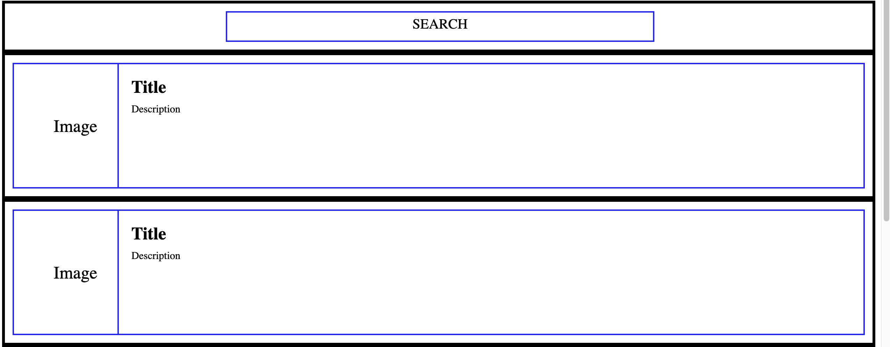
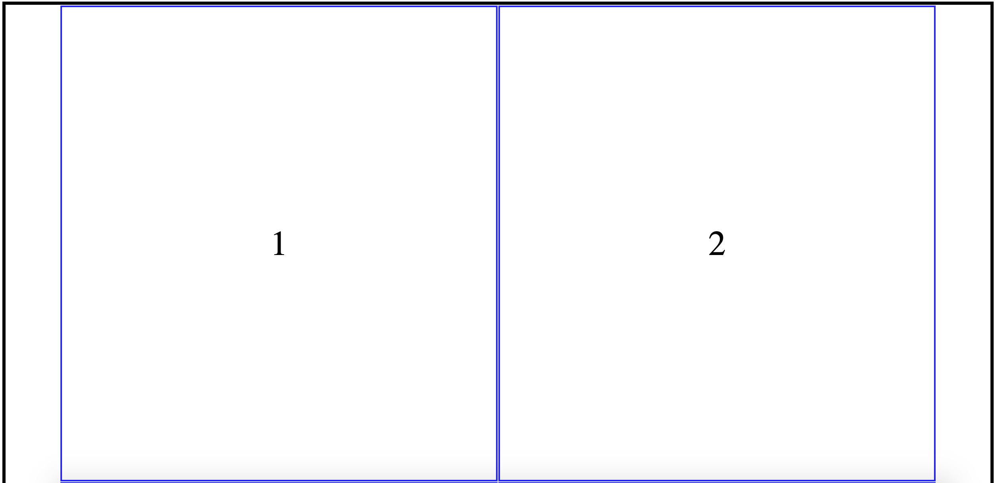

## RESPONSIVE CSS LAYOUTS

#### layouts/layout1

#### layouts/layout2

#### layouts/layout3

#### layouts/layout4

#### layouts/layout5

#### layouts/layout6

#### layouts/layout7

#### layouts/layout8

#### layouts/layout9

#### layouts/layout10

